# Akash Dhanwate

  

   

  

   
   

  
  
  
  

   
   

  

## Mission Control

<table>
  <tr>
    <td width="58%" valign="top">
      <h3>Current Trajectory</h3>
      
I am a B.Tech student in Artificial Intelligence and Data Science from Maharashtra, India. I like building useful things, learning by shipping projects, and improving step by step through real work.

      <ul>
        <li>Building Python projects for logic, automation, and problem solving</li>
        <li>Exploring machine learning, datasets, model workflows, and evaluation</li>
        <li>Creating web and API-based tools with JavaScript and Node.js</li>
        <li>Turning learning projects into clean, documented GitHub repositories</li>
      </ul>
    </td>
    <td width="42%" valign="top">
      <h3>Quick Signal</h3>
      <ul>
        <li><strong>Location:</strong> Maharashtra, India</li>
        <li><strong>Focus:</strong> AI, Data Science, Automation, Web Tools</li>
        <li><strong>Open to:</strong> Collaboration, internships, project work</li>
        <li><strong>Best contact:</strong> <a href="mailto:akashdhanawate117@gmail.com">Email</a> or <a href="https://www.linkedin.com/in/4kashdhanwate">LinkedIn</a></li>
      </ul>
    </td>
  </tr>
</table>

## Tech Radar

**Languages**

**Runtime, Tools, and Workflow**

**Learning and Practicing**

## Project Launchpad

| Project Area | What It Shows | Next Polish |
| --- | --- | --- |
| Calculator App | Python functions, input handling, and logic building | Add tests, screenshots, and usage examples |
| AI & Data Science Projects | Dataset handling, notebooks, model experiments, and learning notes | Publish clearer results, metrics, and model comparisons |
| Automation & Web Projects | JavaScript, Node.js, APIs, and useful workflow tools | Add live demos, clean setup steps, and issue roadmaps |

## Operating Principles

- I build while I learn, then improve the project through feedback.
- I prefer practical output over only theory.
- I document projects so someone else can understand the goal, setup, and result.
- I am working toward becoming a strong AI engineer with clean coding habits.

## Certifications

- Python Fundamentals
- Data Visualization with R

## Collaboration Board

I am open to working on:

- AI and machine learning projects
- Data science projects using real datasets
- Python automation tools
- Web development and API-based applications
- Beginner-friendly open-source contributions

## GitHub Signal

  
  

  

  

## Contact Dock

<table>
  <tr>
    <td><strong>Email</strong></td>
    <td><a href="mailto:akashdhanawate117@gmail.com">akashdhanawate117@gmail.com</a></td>
  </tr>
  <tr>
    <td><strong>LinkedIn</strong></td>
    <td><a href="https://www.linkedin.com/in/4kashdhanwate">linkedin.com/in/4kashdhanwate</a></td>
  </tr>
  <tr>
    <td><strong>GitHub</strong></td>
    <td><a href="https://github.com/Akash-Dhanwate">github.com/Akash-Dhanwate</a></td>
  </tr>
  <tr>
    <td><strong>Instagram</strong></td>
    <td><a href="https://www.instagram.com/ur_4kash">instagram.com/ur_4kash</a></td>
  </tr>
</table>

  

